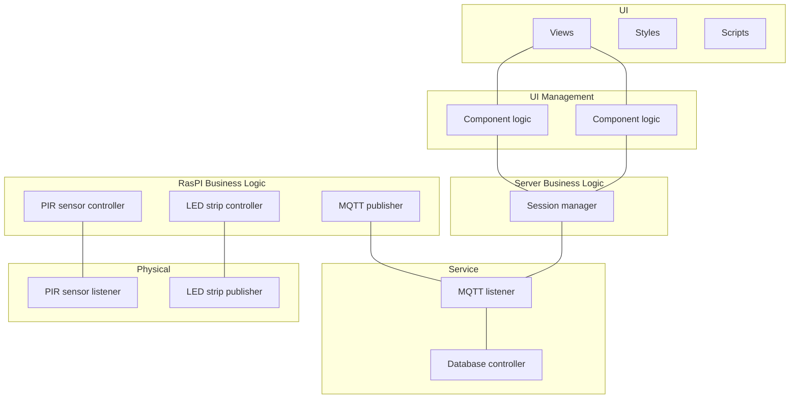

```mermaid
graph TD
    subgraph UI;
    %% One class per html file
    HTML[Views];
    CSS[Styles];
    JS[Scripts];
    end;

    subgraph UIM[UI Management];
    %% Web App
    %% One class per component script
    HTML --- comp1[Component logic];
    HTML --- comp2[Component logic];
    end;

    subgraph B[Server Business Logic];
    %% Web Server
    %% All serious stuff is in here
    comp1 --- session[Session manager];
    comp2 --- session;
    end;

    subgraph PI[RasPI Business Logic];
    %% Processing sensor data, sensor and actuator logic
    something2;
    vib[PIR sensor controller];
    led[LED strip controller];
    end;

    subgraph DB[Service];
    %% Database management
    something2[MQTT publisher] --- user_data[MQTT listener];
    session --- user_data;
    user_data --- database[Database controller];
    end;

    subgraph phys[Physical];
    %% Sensor controllers
    vib --- sensor1[PIR sensor listener];
    led --- act1[LED strip publisher];
    end;
```
