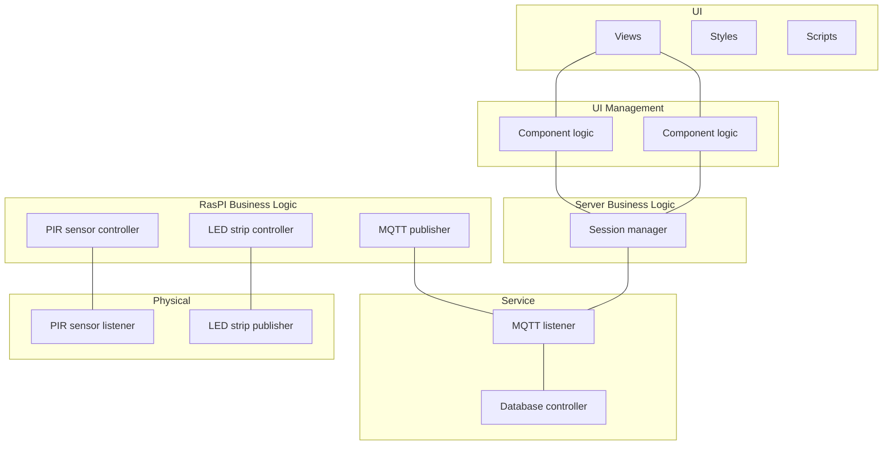

Sequence diagram for local system:
````
title Sensor - Raspberry PI Interaction

participant "++Light Guide Controller++" as ctrl
participant "++MQTT Broker++" as mqtt
participant "++Zigbee Coordinator++" as zb
participant "++PIR Sensor++" as pir
participant "++Light Strip++" as light

activate ctrl
ctrl ->> mqtt: subscribe to PIR
// TODO: maybe change "Light Guide" to product name

loop
pir -> pir: detect movement
activate pir
note over pir: sensor detects something,\n e.g. user enters a new zone

opt change in state
pir ->> zb: publish state
deactivate pir
activate zb
zb ->> mqtt: publish to PIR
deactivate zb
activate mqtt
mqtt ->> ctrl: on_message() callback
deactivate mqtt
activate ctrl
note over ctrl: controller filters out all irrelevant topics, \n i.e. it only reacts to occupancy changes

opt occupancy changed
ctrl ->> mqtt: publish to light_strip/state
deactivate ctrl
activate mqtt
mqtt ->> zb: publish light_strip/state
deactivate mqtt
activate zb
zb ->> light: update light strip state
deactivate zb
end
end
end
````

Mermaid layered diagram:

Alternative:
````mermaid
graph TD;

    %% Caregiver Computer
    subgraph caregiver[Caregiver PC];
        app[Web app];
    end;

    %% Server Computer
    subgraph server_comp[Server Computer];
        server[Web server];
        db[Database];
    end;

    %% Raspberry PI
    subgraph raspi[Raspberry PI];
        mqtt[MQTT broker];
        ztm[Z2M];
        logic[Application];
    end;

    %% PIR Sensor
    subgraph pir[PIR sensor];
        zb_pub1[Zigbee publisher];
    end;

    %% Vibration Sensor
    subgraph vib[Vibration sensor];
        zb_pub2[Zigbee publisher];
    end;

    %% LED Strip
    subgraph led[LED strip];
        zb_sub1[Zigbee subscriber];
    end;

    %% Connections
    zb_pub1 --- ztm;
    zb_pub2 --- ztm;
    zb_sub1 --- ztm;
    server --- app;
    ztm --- mqtt;
    mqtt --- logic;
    logic --- server;
````
