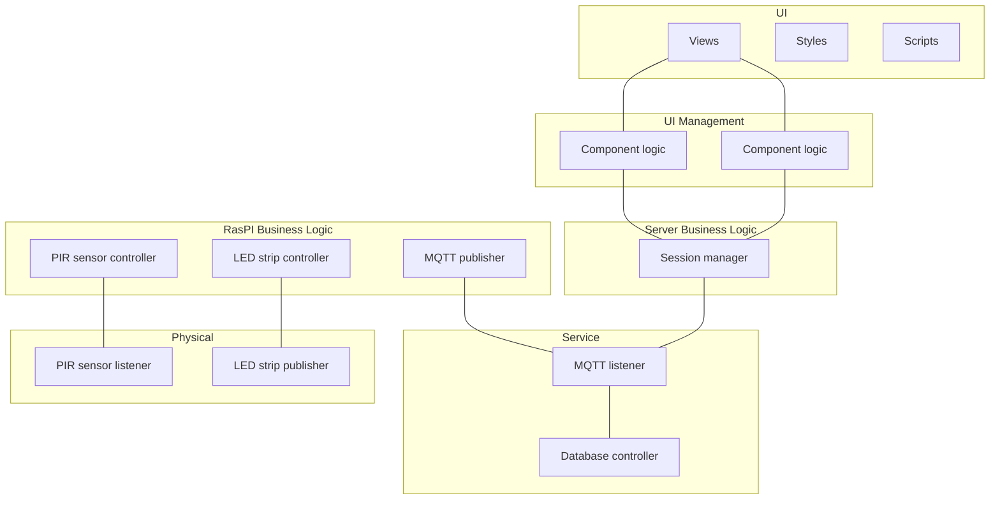

Sequence diagram for local system:
````
title Sensor - Raspberry PI Interaction

participant "++Light Guide Home++" as ctrl
participant "++MQTT Broker++" as mqtt
participant "++Zigbee Coordinator++" as zb
participant "++PIR Sensor++" as pir
participant "++Light Strip++" as light

ctrl ->> mqtt: subscribe to pir_sensor

loop
pir -> pir: detect movement
activate pir #lightgrey
note over pir: sensor detects something,\n e.g. user enters a new zone

opt change in state
pir ->> zb: publish state
deactivate pir 
activate zb #lightgrey
zb ->> mqtt: publish to pir_sensor
deactivate zb
activate mqtt #lightgrey
mqtt ->> ctrl: on_message() callback
deactivate mqtt
activate ctrl #lightgrey
note over ctrl: controller filters out all irrelevant topics, \n i.e. it only reacts to occupancy changes

opt occupancy changed
ctrl ->> mqtt: publish to light_strip/state
deactivate ctrl
activate mqtt #lightgrey
mqtt ->> zb: publish light_strip/state
deactivate mqtt
activate zb #lightgrey
zb ->> light: update light strip state
deactivate zb
end
end
end
````

Sequence diagram for client-server interaction:
````
title Raspberry PI - Server Interaction

participantgroup #eeeeee **Client**
participant "++Light Guide Home++" as client
# participant "++MQTT Publisher++" as mqtt_c
end

participant "++MQTT Broker++" as broker

participantgroup #eeeeee **Server**
#participant "++MQTT Subscriber++" as mqtt_s
participant "++LG Web Server++" as server
participant "++Database Manager" as db
end

note over client,server: MQTT is distributed between client and server.

server ->> broker: subscribe to user_vacancy_data
activate broker #cccccc
broker -->> server: subscription ack
deactivate broker
opt incoming sensor data
[->> client:
activate client #cccccc
note over client: Processes sensor data\n and publishes results in\n a new topic.
client ->> broker: publish to user_vacancy_data
deactivate client
# activate broker #cccccc
# mqtt_c ->> mqtt_s: publish to user_vacancy_data
# deactivate broker #cccccc
activate broker #cccccc
broker ->> server: on_message() callback
deactivate broker
activate server #cccccc
server ->> db: create new entry
activate db #cccccc
db -->> server: ok
deactivate db

deactivate server
end
````

Sequence diagram for Server - Webapp
````
title Server - Caregiver PC Interaction

participantgroup #eeeeee Server
participant "Database Manager" as db
participant "LG Web Server" as s_logic
//vparticipant "Web API" as api
end

participantgroup #eeeeee Caregiver Browser
// participant "Browser\nHTTP Handler" as http
//participant "Vue.js Component" as vue
//participant "DOM" as dom
participant "LG Web App" as vue
end


]-->> *vue: GET web page from 3rd party host

opt caregiver interacts with page element
vue ->> s_logic: user interagtion
activate s_logic #cccccc
opt request requires database access
s_logic -> db: query
deactivate s_logic
activate db #cccccc
db --> s_logic: query result
activate s_logic #cccccc
deactivate db
end
s_logic -->> vue: HTTP response
deactivate s_logic
end
````


Mermaid layered diagram:

Alternative:
````mermaid
graph TD;

    %% Caregiver Computer
    subgraph caregiver[Caregiver PC];
        app[Web app];
    end;

    %% Server Computer
    subgraph server_comp[Server Computer];
        server[Web server];
        db[Database];
    end;

    %% Raspberry PI
    subgraph raspi[Raspberry PI];
        mqtt[MQTT broker];
        ztm[Z2M];
        logic[Application];
    end;

    %% PIR Sensor
    subgraph pir[PIR sensor];
        zb_pub1[Zigbee publisher];
    end;

    %% Vibration Sensor
    subgraph vib[Vibration sensor];
        zb_pub2[Zigbee publisher];
    end;

    %% LED Strip
    subgraph led[LED strip];
        zb_sub1[Zigbee subscriber];
    end;

    %% Connections
    zb_pub1 --- ztm;
    zb_pub2 --- ztm;
    zb_sub1 --- ztm;
    server --- app;
    ztm --- mqtt;
    mqtt --- logic;
    logic --- server;
````

# Implementation Docs
Web Client - Web Server: Fetch Events:
```
Web Client - Web Server: Fetch Events

participant "Web Client" as client
participant "Web Server : Flask Framework" as frame
participant "Web Server : FrontApi" as api
database "MariaDB" as db

activate db #eeeeee
activate frame #eeeeee
activate client #cccccc

alt correct syntax
client ->> frame: ""HTTP GET /fetch_events/<usr>,<pwd>""
activate frame #cccccc
frame ->> api: ""fetch_events(usr, pwd)""
activate api #cccccc
note over api: API hashes ""usr"" and ""pwd"",\ndatabase query returns empty\nset if hash doesn't match.\nSee <snippet ref.>
api -> db: SELECT ...
deactivate api
activate db #cccccc
note over api, db: SELECT query selects caregiver\nthat matches credentials, patient\nthat matches caregiver, and events\n that match patient.\nSee <snippet ref.>
db --> api: list of tuples
activate api #cccccc

alt success
deactivate db
api -->> frame: JSON object
deactivate api
frame -->> client: JSON string
deactivate frame

else empty query result
activate api #cccccc
api -->> frame: JSON object (""success=False"")
activate frame #cccccc
deactivate api
frame -->> client: JSON string ("""success":false"")
deactivate frame


else unknown database error
activate api #cccccc
api -->> frame: JSON object (""success=False"")
activate frame #cccccc
deactivate api
frame -->> client: JSON string ("""success":false"")
deactivate frame
end

else incorrect syntax
client ->> frame: non-existent command
activate frame #cccccc
frame -->> client: HTTP status 404 (not found)
deactivate frame
end


```
